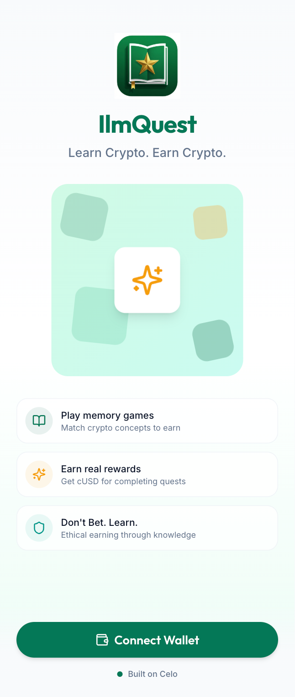
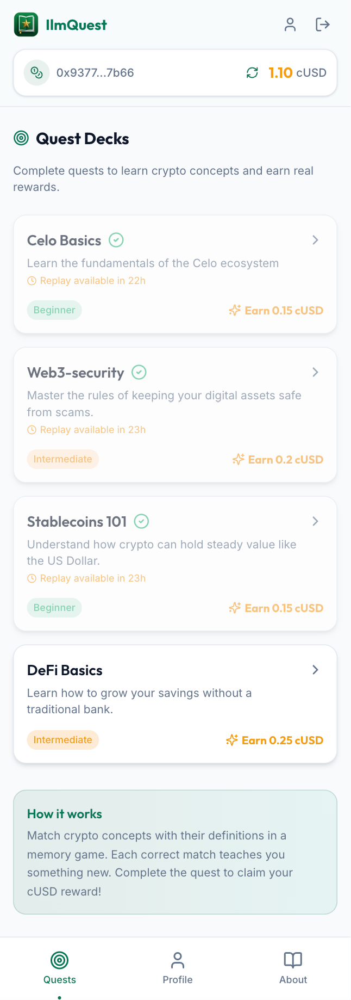
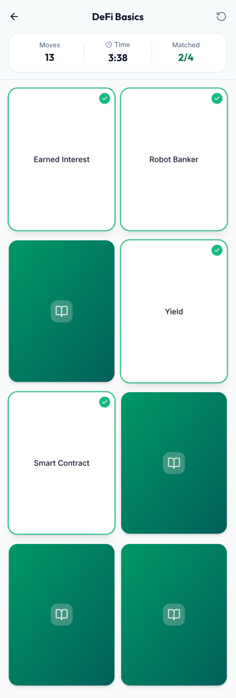
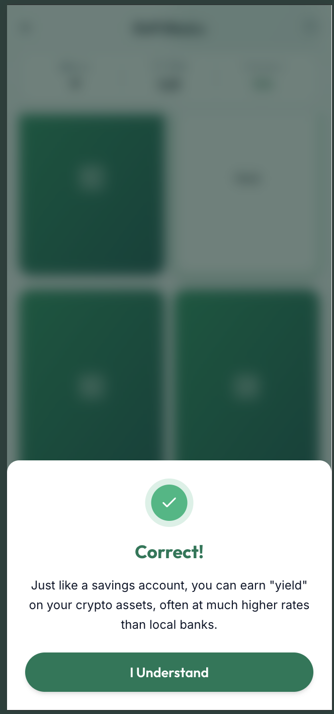
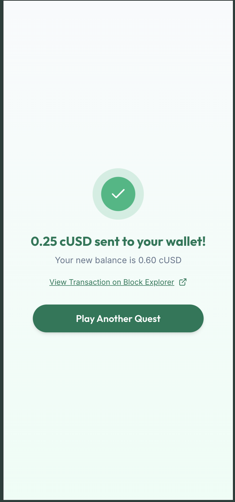
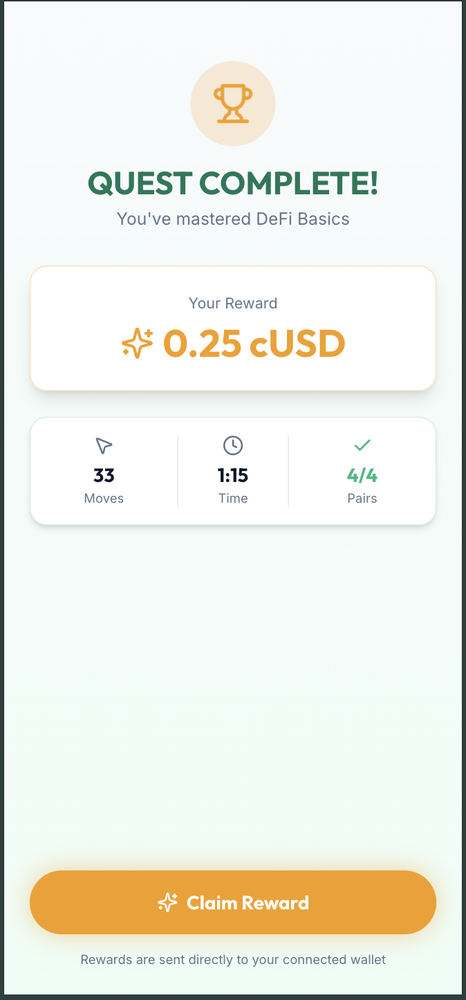
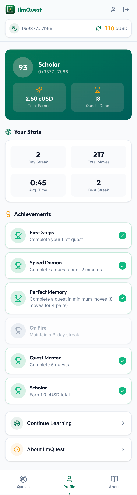
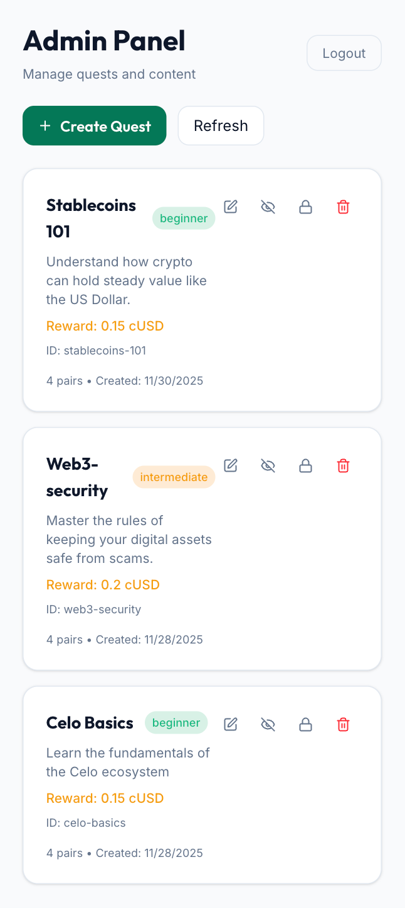
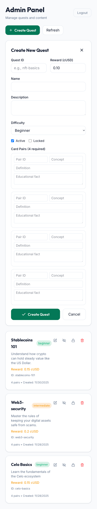

# IlmQuest: The Ethical "Learn-to-Earn" Protocol

### *Turning Knowledge into Capital on the Celo Blockchain*

[](https://nextjs.org/)
[](https://docs.celo.org/)
[](LICENSE)

**Live Demo:** [https://ilmquest-app.vercel.app](https://ilmquest-app.vercel.app)

---

## 🎯 Overview

**IlmQuest** is a decentralized application (dApp) built for the **MiniPay** ecosystem that allows users in emerging markets to earn their first crypto asset (cUSD) by mastering financial concepts.

Unlike "Play-to-Earn" games that often rely on ponzi-nomics or gambling mechanics, IlmQuest utilizes the ancient Islamic Finance concept of **Ju'alah** (Reward for Service). Users perform a verified service—**education**—and receive a guaranteed payment in return.

**Tagline:** *Don't Bet. Learn.*

---

## 📸 Application Screenshots

### Landing Page

*Welcome screen with wallet connection. Users can connect their MiniPay or MetaMask wallet to get started.*

### Quest Dashboard

*Available quests displayed with difficulty levels and rewards. Users can see their balance and select a quest to play.*

### Game in Progress

*Memory matching game interface. Users flip cards to match crypto concepts with their definitions.*

### Knowledge Modal

*Educational fact appears when a pair is matched. Users must acknowledge the fact to continue learning.*

### Victory Screen

*Quest completion screen showing stats (moves, time) and reward amount. Users can claim their cUSD reward here.*

### Reward Claim

*Transaction confirmation and success screen. Shows transaction hash and link to block explorer.*

### Profile Page

*User statistics dashboard showing total earned, quests completed, streaks, achievements, and detailed stats.*

### Admin Dashboard

*Secret admin panel for managing quests. Admins can create, edit, delete, and toggle quest status.*

### Admin Quest Creation

*Form for creating new quests. Admins can add quest details, reward amounts, difficulty, and card pairs.*

---

## ✨ Key Features

- 🎮 **Memory Match Game** - Learn crypto concepts through gamified education
- 💰 **Fee Currency Abstraction** - Pay gas fees in cUSD, no CELO required
- 🔐 **Trusted Oracle** - Backend verifies game completion before reward
- 💸 **On-Chain Rewards** - Direct cUSD payments via smart contract
- 📱 **Mobile-First Design** - Optimized for MiniPay users in emerging markets
- 🎯 **Admin Dashboard** - Dynamic quest management system
- 📊 **User Statistics** - Track progress, streaks, and achievements
- 🔄 **Replay System** - Users can replay quests after 24 hours for revision

---

## 🎮 User Flow & Features Explained

### 1. Landing Page
- **Purpose:** Welcome users and connect wallet
- **Features:**
  - Clean, mobile-first design
  - One-click wallet connection
  - Educational value proposition
  - Mobile wallet detection and instructions

### 2. Quest Dashboard (`/play`)
- **Purpose:** Browse and select available quests
- **Features:**
  - List of all active quests
  - Difficulty indicators (Beginner/Intermediate/Advanced)
  - Reward amounts displayed
  - Quest completion status (checkmark if completed)
  - Replay availability (24-hour cooldown)
  - Balance display (cUSD token balance)

### 3. Game Page (`/play/[levelId]`)
- **Purpose:** Play the memory matching game
- **Features:**
  - 4x4 grid (8 cards, 4 pairs)
  - Flip cards to reveal concepts/definitions
  - Match pairs to learn facts
  - Move counter and timer
  - Knowledge modal on each match
  - Victory screen on completion

### 4. Victory Screen
- **Purpose:** Display results and claim reward
- **Features:**
  - Game statistics (moves, time, pairs matched)
  - Reward amount display
  - Backend verification status
  - Claim reward button
  - Transaction hash and block explorer link
  - Balance refresh after claim

### 5. Profile Page (`/profile`)
- **Purpose:** View user statistics and achievements
- **Features:**
  - Total earned (cUSD)
  - Quests completed count
  - Current streak and best streak
  - Total moves across all quests
  - Average completion time
  - Achievement badges
  - Real-time data from MongoDB

### 6. Admin Dashboard (`/admin-ilmquest-secret-2024`)
- **Purpose:** Manage quests dynamically (secret route)
- **Features:**
  - Wallet signature authentication
  - View all quests (including inactive)
  - Create new quests
  - Edit existing quests
  - Delete/disable quests
  - Toggle active/inactive status
  - Toggle locked/unlocked status
  - Quest validation and error handling

---

## 🚀 Quick Start

### Prerequisites

- Node.js 18+ and pnpm
- MongoDB Atlas account (or local MongoDB)
- MetaMask or MiniPay wallet
- Celo Sepolia testnet access

### Installation

1. **Clone the repository**
   ```bash
   git clone https://github.com/YOUR_GITHUB_USERNAME/IlmQuest.git
   cd IlmQuest
   ```

2. **Install dependencies**
   ```bash
   pnpm install
   ```

3. **Set up environment variables**

   **Backend** (`apps/backend/.env`):
   ```env
   MONGODB_URI=your_mongodb_connection_string
   ADMIN_PRIVATE_KEY=0x...
   VAULT_ADDRESS=0x9857b9d8F49C035Df7e56397870A0a16d851e371
   CHAIN_ID=11142220
   ADMIN_WALLETS=0xYourAdminWalletAddress
   PORT=4000
   ```

   **Frontend** (`apps/frontend/.env.local`):
   ```env
   NEXT_PUBLIC_BACKEND_URL=http://localhost:4000
   ```

4. **Run migration script** (import existing quests)
   ```bash
   cd apps/backend
   node scripts/migrateQuests.js
   ```

5. **Start development servers**
   ```bash
   # Terminal 1: Backend
   cd apps/backend
   pnpm dev

   # Terminal 2: Frontend
   cd apps/frontend
   pnpm dev
   ```

6. **Open the app**
   - Frontend: http://localhost:3000
   - Backend: http://localhost:4000

---

## 🏗️ Project Structure

```
IlmQuest/
├── apps/
│   ├── frontend/          # Next.js 14 frontend application
│   │   ├── app/           # App Router pages
│   │   ├── components/    # React components
│   │   ├── hooks/         # Custom React hooks
│   │   └── lib/           # Utilities and config
│   ├── backend/           # Node.js/Express backend API
│   │   ├── src/
│   │   │   ├── routes/    # API routes
│   │   │   ├── middleware/# Auth middleware
│   │   │   ├── services/  # Business logic
│   │   │   └── db/       # MongoDB connection
│   │   └── scripts/      # Migration scripts
│   └── contracts/         # Solidity smart contracts (Hardhat)
│       ├── contracts/    # Solidity files
│       ├── test/         # Contract tests
│       └── ignition/     # Deployment scripts
├── ArchectureAndUserFlow.md
├── DesignSystem.md
├── projectIdea.md
├── projectPRD.md
└── README.md
```

---

## 🛠️ Tech Stack

### Frontend
- **Framework:** Next.js 14 (App Router)
- **Language:** TypeScript
- **Styling:** Tailwind CSS
- **UI Components:** shadcn/ui
- **Wallet:** ethers.js (MiniPay/MetaMask)
- **State Management:** React Context API

### Backend
- **Runtime:** Node.js
- **Framework:** Express.js
- **Database:** MongoDB (Atlas)
- **Signing:** ethers.js (ECDSA signatures)
- **Security:** Helmet, CORS

### Smart Contracts
- **Language:** Solidity
- **Framework:** Hardhat
- **Network:** Celo Sepolia Testnet
- **Standards:** ERC20, EIP-712
- **Libraries:** OpenZeppelin

---

## 📋 Available Scripts

### Root Level
```bash
pnpm dev          # Start all development servers
pnpm build        # Build all packages
pnpm lint         # Lint all code
```

### Contracts
```bash
cd apps/contracts
pnpm compile      # Compile smart contracts
pnpm test         # Run contract tests
pnpm deploy:sepolia  # Deploy to Celo Sepolia
```

### Backend
```bash
cd apps/backend
pnpm dev          # Start backend server
node scripts/migrateQuests.js  # Import quests to database
```

### Frontend
```bash
cd apps/frontend
pnpm dev          # Start Next.js dev server
pnpm build        # Build for production
```

---

## 🎮 How It Works

### Complete User Journey

1. **User visits app** → Landing page with wallet connection
2. **Connects wallet** → MiniPay or MetaMask (desktop/mobile)
3. **Selects quest** → Chooses from available quests (Celo Basics, Stablecoins 101, etc.)
4. **Plays game** → Memory matching: flips cards to match concepts with definitions
5. **Learns facts** → Knowledge modal appears on each successful match
6. **Completes quest** → All 4 pairs matched successfully
7. **Backend verifies** → Oracle checks game duration, moves, and rate limits
8. **Receives signature** → Backend cryptographically signs reward authorization
9. **Claims reward** → Smart contract validates signature and pays cUSD
10. **Pays gas in cUSD** → Fee Currency Abstraction - no CELO needed!
11. **Views profile** → Stats, achievements, and total earnings updated

### Technical Flow

```
User Action → Frontend → Backend API → MongoDB → Smart Contract → Blockchain
```

- **Frontend:** Handles UI, wallet connection, game logic
- **Backend:** Verifies games, signs rewards, manages quests
- **Smart Contract:** Validates signatures, distributes rewards
- **Blockchain:** Records transactions, maintains state

---

## 🔐 Smart Contracts

### Deployed Contracts (Celo Sepolia)

- **JualahVault:** `0x9857b9d8F49C035Df7e56397870A0a16d851e371`
  - Handles reward distribution
  - Verifies EIP-712 signatures
  - Implements replay protection (nonce tracking)
  - ERC20 token transfers

- **MockERC20 (Reward Token):** `0x980DC8695F6D30A3b20770Ad42A5458784CBeA90`
  - Test token for rewards (cUSD equivalent)
  - Used for Fee Currency Abstraction

**Block Explorer:** https://celo-sepolia.blockscout.com

**View Contracts:**
- [JualahVault on Blockscout](https://celo-sepolia.blockscout.com/address/0x9857b9d8F49C035Df7e56397870A0a16d851e371)
- [MockERC20 on Blockscout](https://celo-sepolia.blockscout.com/address/0x980DC8695F6D30A3b20770Ad42A5458784CBeA90)

---

## 🎯 Key Innovations

### 1. Fee Currency Abstraction
Users pay gas fees in cUSD (the same token they earn), eliminating the need for CELO tokens. This removes a major onboarding barrier for new users in emerging markets.

**Implementation:** Smart contract calls include `feeCurrency: REWARD_TOKEN_ADDRESS` parameter.

### 2. Jualah Model
Ethical reward system based on Islamic Finance principles. Users are paid for a service (learning), not gambling. This makes crypto accessible to users who avoid gambling-based platforms.

### 3. Trusted Oracle Pattern
Backend verifies game completion off-chain (checking duration, moves, rate limits), then cryptographically signs reward authorizations. Smart contract validates signatures before payout, preventing bots and abuse.

### 4. Mobile-First Design
Optimized for low-bandwidth connections and small screens, perfect for MiniPay users in emerging markets. Works seamlessly on Opera MiniPay and MetaMask Mobile.

### 5. Dynamic Quest Management
Admin dashboard allows adding/editing quests without code changes. Quests stored in MongoDB, enabling rapid content updates.

---

## 📚 Documentation

- **[Architecture & User Flow](ArchectureAndUserFlow.md)** - Technical architecture and data flow
- **[Design System](DesignSystem.md)** - UI/UX guidelines and components
- **[Project Idea](projectIdea.md)** - Business logic and vision
- **[PRD](projectPRD.md)** - Product requirements document
- **[Adding New Quests](ADDING_NEW_QUESTS.md)** - Guide for adding quests
- **[Admin Setup](ADMIN_BACKEND_SETUP.md)** - Backend admin configuration
- **[Profile Data Explanation](PROFILE_DATA_EXPLANATION.md)** - Profile stats breakdown

---

## 🧪 Testing

### Smart Contracts
```bash
cd apps/contracts
pnpm test
```

Tests cover:
- Valid reward claims
- Replay protection
- Invalid signatures
- Edge cases

### Backend API
```bash
cd apps/backend
node test-api.js
```

### Frontend
Manual testing recommended:
1. Connect wallet
2. Play a quest
3. Verify reward claim
4. Check profile stats
5. Test replay cooldown

---

## 🚀 Deployment

### Frontend (Vercel)
```bash
cd apps/frontend
vercel deploy
```

**Live URL:** https://ilmquest-app.vercel.app

### Backend (Railway/Render)
1. Connect GitHub repository
2. Set environment variables
3. Deploy

### Smart Contracts
Already deployed to Celo Sepolia testnet. See contract addresses above.

---

## 🔒 Security Features

- **Wallet Signature Authentication** - Admin routes require cryptographic signatures
- **Rate Limiting** - Prevents quest spam (24-hour cooldown)
- **Replay Protection** - Nonce tracking prevents double-claiming
- **Input Validation** - Server-side validation for all quest data
- **CORS Protection** - Configured for specific origins
- **Helmet Security** - Security headers enabled

---

## 👥 Contributing

This is a hackathon project. For questions or issues, please open a GitHub issue.

---

## 📄 License

MIT License - see LICENSE file for details

---

## 🙏 Acknowledgments

- Celo Foundation for the amazing blockchain infrastructure
- MiniPay team for wallet integration
- OpenZeppelin for secure smart contract libraries
- Next.js and Vercel for the excellent framework

---

## 📞 Contact

- **GitHub:** [YOUR_GITHUB_USERNAME](https://github.com/YOUR_GITHUB_USERNAME)
- **Email:** YOUR_EMAIL@example.com
- **Twitter:** [@YOUR_TWITTER_HANDLE](https://twitter.com/YOUR_TWITTER_HANDLE)
- **Live Demo:** https://ilmquest-app.vercel.app

---

**Built with ❤️ for the Celo ecosystem**
